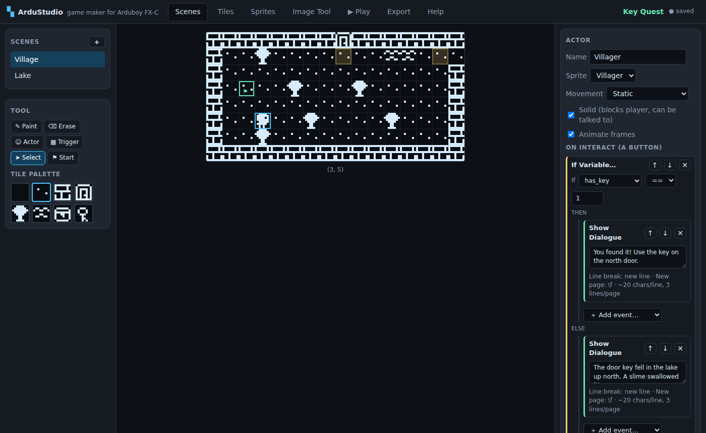
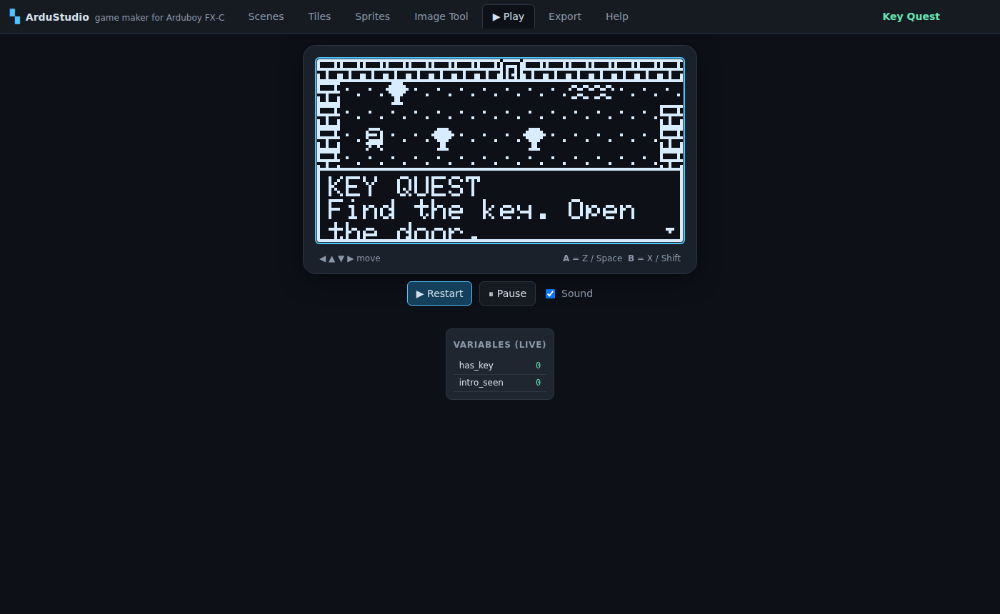

# ArduStudio

**A visual game maker for the [Arduboy FX‑C](https://www.arduboy.com/shop/p/arduboy-fx-c)** (and the original
Arduboy / Arduboy FX), in the spirit of [GB Studio](https://www.gbstudio.dev) and
[Bitsy](https://make.bitsy.org): paint scenes, place characters, script them with visual event
blocks, play-test instantly in the browser — then export a real Arduino sketch and flash it to
the hardware.



No installation, no build step, no dependencies: it's a static web app.

```bash
# from the repo root — any static file server works
npx http-server .        # then open http://localhost:8080
# or: python3 -m http.server
```

> Opening `index.html` directly with `file://` won't work in most browsers because the app uses
> ES modules — serve the folder instead (two keystrokes with `npx http-server`).

The app boots with **Key Quest**, a complete little demo adventure (dialogue, branching,
variables, item fetching, tile swapping, two scenes). Play it in the **▶ Play** tab, then pick it
apart to see how everything is wired.

## What you get

| Tab | What it does |
|---|---|
| **Scenes** | Paint 16×8 tile maps (one Arduboy screen per scene, Bitsy-style). Place actors, drag trigger areas, set the player start. Inspector edits the selected entity and its script. |
| **Tiles** | 1-bit 8×8 pixel editor with solid/walkable flag, flip/shift/invert tools. |
| **Sprites** | Animated sprites (up to 4 frames; 8×8, 16×8, 8×16, 16×16) with live preview. |
| **Image Tool** | PNG → 1-bit converter (threshold + invert). Import as tiles or a sprite, or copy a `PROGMEM` C array in the standard Arduboy vertical-byte format. |
| **▶ Play** | Full play-test emulator at 60 fps with sound and a live variable watch. Runs the *same bytecode* as the exported game and renders text with the genuine Arduboy2 `font5x7`. |
| **Export** | One click → complete `.ino` sketch. Also project save/load as JSON (plus localStorage autosave). |
| **Help** | The manual: workflow, scripting recipes, flashing instructions, limits. |

### Visual scripting events

`Show Dialogue` (auto word-wrapped, paged), `If Variable… / Else`, `Set / Add Variable`,
`Change Scene`, `Teleport Player`, `Set Tile` (open doors, reveal passages), `Hide / Show Actor`,
`Play Tone`, `Wait`, `Stop Script`. Scripts attach to actors (on interact), triggers (on enter)
and scenes (on enter).

### The game engine (on device and in the browser)

- Grid movement with smooth pixel interpolation; solid tiles and solid actors block.
- Actors: static, random wander, horizontal / vertical patrol; frame animation.
- Face an actor and press **A** to run its script; walk onto a trigger to run its script.
- Dialogue box with typewriter effect, page breaks, A-to-advance (B skips the typewriter).
- 32 byte-sized variables drive all game logic.
- Sound through the Arduboy's beeper (`BeepPin1`) — no extra libraries needed.

Scripts compile to a compact bytecode. The browser emulator (`js/emulator.js`) and the C++ engine
embedded in the exported sketch (`js/codegen.js`) execute **the same bytes with the same update
order and constants**, so what you play-test is what ships.



## From project to hardware

1. **Export** tab → **⬇ Download .ino**.
2. Open it in the [Arduino IDE](https://www.arduino.cc/en/software), install the **Arduboy2**
   library (Library Manager), select board **Arduino Leonardo** (or **Arduboy**), and upload
   over USB‑C.
3. That's it — the sketch has zero dependencies beyond Arduboy2 and fits comfortably in the
   ATmega32u4's 28 KB (the Key Quest demo builds to ~17 KB including the USB stack).

## Repo layout

```
index.html, css/          app shell
js/model.js               project data model, default assets, demo game
js/compiler.js            script → bytecode compiler (shared by emulator & export)
js/emulator.js            browser play-test runtime (Arduboy twin)
js/codegen.js             .ino generator (data + C++ engine)
js/font5x7.js             Arduboy2's font, extracted for pixel-identical text
js/*.js                   editor panels (scene, pixel, script, image, play, export)
tools/check_codegen.mjs   g++ syntax check of generated sketches (stub headers)
tools/test_runtime.mjs    scripted full playthrough of the demo in the emulator
tools/build_avr.sh        real avr-gcc build against real Arduboy2 → game.hex
```

## Verification

```bash
node tools/test_runtime.mjs     # 28 assertions: boots, talks, fetches key, opens door
node tools/check_codegen.mjs    # generated sketches pass g++ -Wall -Wextra
tools/build_avr.sh              # optional: full ATmega32u4 build (needs gcc-avr, avr-libc)
```

The AVR build compiles the generated sketch against the unmodified Arduboy2 library and Arduino
AVR core and links a flashable `game.hex` — verified at 17,058 bytes flash / 1,714 bytes RAM.

## Limits (v1)

64 tiles · 32 sprites × 4 frames · 8 actors + 8 triggers per scene · 32 variables ·
256 dialogue strings · scenes are single screens (16×8 tiles).

Roadmap ideas: undo/redo, EEPROM save-game events, ArduboyTones music sequences, multi-screen
scrolling scenes, ArduboyFX data export for asset-heavy games, `.arduboy` package export.

## References

- [Arduboy2 library](https://github.com/MLXXXp/Arduboy2) — the standard Arduboy game library
- [Arduboy quick start](https://www.arduboy.com/quick-start)
- [Community graphics format tutorial](https://community.arduboy.com/t/make-your-own-arduboy-game-part-6-graphics/7929)
- [Arduboy image converters](https://community.arduboy.com/t/all-the-arduboy-image-converters/3568)
- Ecosystem libraries worth knowing: **ArduboyTones**, **ArduboyPlaytune**, **ArduboyFX**, **FixedPoints**, **ATMlib**

The bundled `js/font5x7.js` is extracted from the Arduboy2 library (BSD-3-Clause) so browser text
matches the device pixel-for-pixel.
