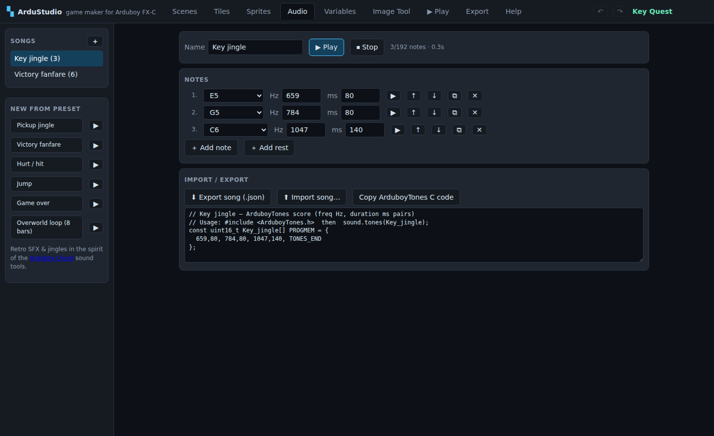
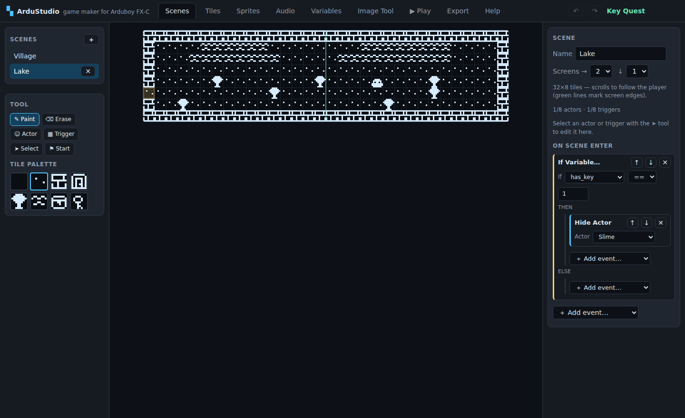

# ArduStudio

**A visual game maker for the [Arduboy FX‑C](https://www.arduboy.com/shop/p/arduboy-fx-c)** (and the original
Arduboy / Arduboy FX), in the spirit of [GB Studio](https://www.gbstudio.dev) and
[Bitsy](https://make.bitsy.org): paint scenes, place characters, script them with visual event
blocks, play-test instantly in the browser — then export a real Arduino sketch and flash it to
the hardware.


### Three ways to run it

**1. Portable single file (offline, no install) — the recommended way.** Build
`dist/ArduStudio.html` — the whole app in one ~215 KB file. Double-click it; it works offline in
any browser, makes zero network requests, and needs no server. In **Chrome and Edge it gets real
native Save/Open dialogs** (the File System Access API works on `file://` pages), so Save writes
straight back to the same file just like a desktop app:

```bash
npm install && npm run build:offline    # → dist/ArduStudio.html
```

**2. Desktop app** — the same thing in an Electron window with a native File menu. Worth it
mainly if you want a taskbar app or use Firefox (which has no file-picker API):

```bash
npm run start:desktop      # run it
npm run package:win        # → out/ArduStudio-win32-x64/ArduStudio.exe
npm run package:linux      # → out/ArduStudio-linux-x64/ArduStudio
```

**3. From source, served.** No build step, no dependencies:

```bash
npx http-server .          # then open http://localhost:8080
```

> Opening the *source* `index.html` directly with `file://` won't work: the sources are ES
> modules, and browsers block module scripts over `file://`. That is exactly what
> `build:offline` solves — it bundles everything into one classic script. Use
> `dist/ArduStudio.html` when you want a file you can just double-click.

The app boots with **Key Quest**, a complete little demo adventure (dialogue, branching, variables,
item fetching, tile swapping, music, a scripted actor move, and a two-screen scrolling lake). Play it
in the **▶ Play** tab, then pick it apart to see how everything is wired.

## What you get

| Tab | What it does |
|---|---|
| **Scenes** | Paint tile maps — one Arduboy screen (Bitsy-style) or up to 4×4 screens that **scroll** to follow the player. Place actors, drag trigger areas, set the player start. Inspector edits the selected entity, its collision settings and each of its lifecycle scripts. |
| **Tiles** | 1-bit 8×8 pixel editor with solid/walkable flag, flip/shift/invert tools. |
| **Sprites** | Animated sprites (up to 4 frames; 8×8, 16×8, 8×16, 16×16) with live preview, and named animation states — frame ranges like Idle or Walk that scripts can select. |
| **Audio** | Compose songs and sound effects as ArduboyTones sequences. Note-name or raw-Hz entry, browser preview, retro presets, and import/export as `.song.json` or a `PROGMEM` C array. |
| **Variables** | Central manager for all 32 byte variables, with live usage tracking showing every script that reads, writes or prints each one. Renaming carries `$name` references in text and expressions along with it. |
| **Image Tool** | PNG → 1-bit converter (threshold + invert). Import as tiles or a sprite, or copy a `PROGMEM` C array in the standard Arduboy vertical-byte format. |
| **▶ Play** | Full play-test emulator at 60 fps with sound and a live variable watch. Runs the *same bytecode* as the exported game and renders text with the genuine Arduboy2 `font5x7`. |
| **Export** | One click → complete `.ino` sketch. Also project save/load as JSON (plus localStorage autosave). |
| **Help** | The manual: workflow, scripting recipes, flashing instructions, limits. |



### Visual scripting events

`Show Dialogue` (auto word-wrapped, paged), `Display Menu` (2–8 options, two layouts,
optional cancel), `Display Multiple Choice`, `If Variable… / Else`, `Set / Add Variable`,
`Math Functions`, `Evaluate Math Expression`,
`Change Scene`, `Teleport Player`, `Set Tile` (open doors, reveal passages), `Hide / Show Actor`,
`Move Actor` (walks and blocks the script until it arrives, or teleports),
`Set Actor Sprite`, `Set Actor Direction`, `Set Actor Movement Speed`, `Actor Effects`
(flicker / shake), `Launch Projectile`, `Attach Script To Button` (with optional override
of the default action), `Remove Button Script`, `Pause Script Until Input Pressed`,
`If Joypad Input Held`, `If Actor At Position`, `If Actor Distance From Actor`,
`Store Actor Direction In Variable`, `Store Actor Position In Variables`,
`Comment`, `Event Group`, `If Math Expression`, `Loop While Math Expression`, `Loop`,
`Start Script`, `Switch`,
`Seed Random Number Generator`, `Set Actor Animation Frame / Speed / State`,
`Show / Hide Overlay`, `Overlay Move To`, `Set Overlay Scanline Cutoff`, `Draw Text`,
`Push / Pop / Pop All Scenes`, `Fade In / Out`, `Play Tone`,
`Play / Stop Song`, `Set RGB LED` (analog PWM or digital on/off), `Save Game`, `Load Game`,
`Save Exists → Var`, `Delete Save`, `Wait`, `Stop Script`.

Most actor events can target **the player** as well as *Self* or a named scene actor —
`Set Actor Sprite`, `Actor Effects`, `Set Actor Direction`, `Hide / Show Actor` and
`Set Actor Animation Frame / Speed / State`, on top of the query events that already
could. That is how you do a sword swing (swap the player's sprite, wait, swap back) or a
damage flash. Hiding the player is visual only — it keeps moving and still fires triggers.
`Set Actor Movement Speed` and `Move Actor` stay actor-only: the player walks tile-by-tile
rather than at a pixel speed, and `Teleport Player` already covers moving it.

**Math Functions** and **Evaluate Math Expression** put a calculated result into a variable —
`$health - $defence` for damage, `rnd(6)` for a die roll. They are the same event underneath, so
Math Functions compiles to exactly the bytes the matching expression would; pick whichever reads
better. Results **stop at 0 and 255 rather than wrapping**, so overkill damage floors at 0 instead
of rolling round to 251, and `Add To Variable` now behaves the same way. The arithmetic itself has
±32767 of room — only the final store is capped.

**Loop** repeats its events forever, so something inside must end it — a `Wait` to stay
responsive, or `Stop Script` / `Change Scene` to break out. A loop with none of those never
hands the console back, and the exporter warns you rather than letting the game freeze.

**Start Script** runs another script in the same scene and carries straight on. That is what
`On Update` needs: it must finish inside its frame, so it cannot show dialogue or wait — but it
can *start* a script that does. Inside the started script, `Self` means the actor that owns it.

**Copy/paste** works on events (⧉ / ⎘ on any block, carrying everything nested inside) and on
whole actors, sprite and all four scripts included — so a second monster is a paste, not a
re-entry. Copies go through the system clipboard, so they cross scenes, tabs and projects.
References that do not fit the destination are repaired and reported, not left broken.

### Script lifecycle

Each entity carries several named scripts, picked from a tab strip in the inspector:

| Entity | Slots |
|---|---|
| **Actor** | `On Interact` (A button) · `On Init` · `On Hit` (collision) · `On Update` (every frame) |
| **Trigger** | `On Enter` · `On Leave` |
| **Scene** | `On Init` · `On Player Hit` |

Actors initialise before the scene does. Only one script occupies the VM at a time, so
anything that fires while a script is blocked queues up behind it. `On Update` is the
exception: it runs outside that queue every frame and must finish within it, so the
compiler warns about — and skips — any event that would pause it.

### The game engine (on device and in the browser)

- Grid movement with smooth pixel interpolation; solid tiles and solid actors block.
- Scrolling camera for multi-screen scenes, clamped at map edges (single-screen scenes never scroll).
- Actors: static, random wander, horizontal / vertical patrol; frame animation.
- Face an actor and press **A** to run its script; walk onto a trigger to run its script.
- Dialogue box with typewriter effect, page breaks, A-to-advance (B skips the typewriter).
- 32 byte-sized variables drive all game logic.
- Music and SFX via **ArduboyTones**, with looping background tracks.
- Menus and yes/no prompts that write the player's answer into a variable.
- Scripts attachable to any of the six buttons, optionally replacing the default action.
- Collision groups, per-actor `On Hit` scripts, and a pool of 6 eight-directional projectiles.
- Actor queries — position, straight-line distance and facing — that branch or write to variables.
- `$name` in any on-screen text prints that variable's value, read as it is drawn — so a
  `Draw Text` score keeps itself up to date. Type `$` in a text field to search your variables.
- Integer math expressions (`6 * $health`), compiled to RPN at build time and run on a tiny
  stack machine, so the device never parses anything.
- Named sprite animation states, with per-actor animation frame, speed and loop control.
- A software overlay panel with a scanline cutoff, plus text drawn on the scene or the overlay.
- Per-actor facing and movement speed; flicker and shake effects.
- A scene stack — push a scene and pop back to the exact tile you left, with dithered fades.
- RGB LED feedback, analog (PWM brightness) or digital (on/off).
- Save games in EEPROM — variables, current scene and player position, surviving power-off.

Scripts compile to a compact bytecode. The browser emulator (`js/emulator.js`) and the C++ engine
embedded in the exported sketch (`js/codegen.js`) execute **the same bytes with the same update
order and constants**, so what you play-test is what ships.


A two-screen scrolling scene in the editor — green lines mark screen boundaries:



## From project to hardware

1. **Export** tab → **⬇ Download .ino**.
2. Open it in the [Arduino IDE](https://www.arduino.cc/en/software), install the **Arduboy2** and
   **ArduboyTones** libraries (Library Manager), select board **Arduino Leonardo** (or **Arduboy**),
   and upload over USB‑C.
3. That's it — the sketch needs nothing beyond those two libraries and fits comfortably in the
   ATmega32u4's 28 KB (the Key Quest demo builds to ~18 KB including the USB stack).

## Repo layout

```
index.html, css/          app shell
js/model.js               project data model, default assets, songs, demo game
js/compiler.js            script → bytecode compiler (shared by emulator & export)
js/expression.js          math expression parser → RPN bytes, plus the reference evaluator
js/emulator.js            browser play-test runtime (Arduboy twin)
js/codegen.js             .ino generator (data + C++ engine)
js/font5x7.js             Arduboy2's font, extracted for pixel-identical text
js/*.js                   editor panels (scene, pixel, script, audio, variables, image, play, export)
js/sidebars.js            draggable, persisted side-panel widths
desktop/main.cjs          Electron main process (window, menu, native dialogs)
desktop/preload.cjs       contextBridge exposing a minimal native API
js/desktop.js             renderer side of the desktop bridge (no-op in a browser)
tools/build_offline.mjs   bundles everything into one self-contained HTML file
tools/check_codegen.mjs   g++ syntax check of generated sketches (stub headers)
tools/test_runtime.mjs    scripted full playthrough of the demo in the emulator
tools/build_avr.sh        real avr-gcc build against real Arduboy2 → game.hex
```

## Verification

```bash
node tools/test_runtime.mjs     # 279 assertions: playthrough, camera, saves, songs, menus, LED,
                                #   input, lifecycle slots, collisions, projectiles, scene stack,
                                #   actor queries, expressions, switch, animation states, overlay,
                                #   variable values in text
node tools/check_codegen.mjs    # demo, blank and an all-features project compile AND link
tools/build_avr.sh              # optional: full ATmega32u4 build (needs gcc-avr, avr-libc)
PROJECT=all-features tools/build_avr.sh   # the worst case: a game using every subsystem
```

The AVR build compiles the generated sketch against the unmodified Arduboy2 and ArduboyTones
libraries and the Arduino AVR core, linking a flashable `game.hex`.

**Your game only carries the engine features it uses.** Optional subsystems — overlay, draw
text, projectiles, collisions, expressions, scene stack, fades, save games, songs, menus,
button scripts, per-frame scripts — are stripped from the generated sketch when nothing in the
project scripts them, so they cost neither flash nor RAM. Against the ATmega32u4's ~28 KB of
usable flash and 2,560 bytes of RAM:

| Project | Flash | RAM |
|---|---|---|
| Key Quest demo | 23,468 | 1,949 |
| Every subsystem at once | 27,130 | 2,047 |

The optional subsystems come to about 3.4 KB of flash in total, so a game reaching for all of
them has roughly 1.9 KB left for its own scenes and art.

## Offline / desktop builds

`tools/build_offline.mjs` uses esbuild to bundle the ES-module sources into a single IIFE and
inlines it, plus the CSS, into one HTML file. The desktop app loads that same bundled file
rather than `index.html` — which sidesteps the ES-module-over-`file://` restriction entirely
and guarantees the desktop and portable builds run identical code.

File I/O (`js/fileio.js`) has three tiers and picks the best available, so one codebase serves
every build:

1. **Electron** — native dialogs via the main process.
2. **File System Access API** — `showSaveFilePicker` / `showOpenFilePicker`. Chrome and Edge
   expose these even on `file://` pages, so the portable single file gets real Save/Open dialogs
   with no packaging at all. The file handle is kept, so *Save* overwrites in place and
   *Save As* re-prompts.
3. **Fallback** — download + file chooser, for Firefox and older browsers.

The Export tab says which mode is active, and the title bar shows the open filename.
<kbd>Ctrl</kbd>+<kbd>S</kbd> saves and <kbd>Ctrl</kbd>+<kbd>O</kbd> opens.

Notes on the packaged apps:

- They are ~265 MB unpacked. That is Electron's floor, not ArduStudio — the app itself is
  210 KB. If size matters, use the portable HTML.
- The Windows `.exe` is unsigned, so SmartScreen shows a one-time
  *"More info → Run anyway"*. Signing needs a certificate.

## Editing

Both side panels resize by dragging the bar on their inner edge; the width is kept in
localStorage, and double-clicking the bar restores the default.

Every event block collapses with the ▾ button in its corner; `Comment` and `Event Group` put
their own text in the block title, so a collapsed one still says what it is.

Undo/redo covers every edit — <kbd>Ctrl</kbd>+<kbd>Z</kbd> / <kbd>Ctrl</kbd>+<kbd>Y</kbd> (or the
↶ ↷ buttons), 100 steps deep, with a drag-paint stroke counting as one step. Projects autosave to
localStorage and can be saved to / loaded from JSON files.

## Limits

64 tiles · 32 sprites × 4 frames · 8 actors + 8 triggers per scene · 32 variables ·
32 songs × 192 notes · 256 dialogue strings · 8 options per menu (~9 chars each) ·
6 buttons with one attached script each · 6 projectiles in flight ·
4 animation states per sprite · 8 Switch options · 4 pieces of drawn text ·
8-deep scene stack · 3 collision groups plus the player ·
scenes from 1×1 to 4×4 screens (16×8 … 64×32 tiles) · 16 live `Set Tile` changes per scene.

Roadmap ideas: ArduboyFX data export for asset-heavy games, multiple save slots, `.arduboy` package
export, two-channel music.

## References

- [Arduboy2 library](https://github.com/MLXXXp/Arduboy2) — the standard Arduboy game library
- [Arduboy quick start](https://www.arduboy.com/quick-start)
- [Community graphics format tutorial](https://community.arduboy.com/t/make-your-own-arduboy-game-part-6-graphics/7929)
- [Arduboy image converters](https://community.arduboy.com/t/all-the-arduboy-image-converters/3568)
- [ArduboyTones](https://github.com/MLXXXp/ArduboyTones) — the tone-sequence library the Audio tab targets
- [Arduboy Cloud](https://cloud.arduboy.com) — browser IDE with its own music/SFX creators; same ArduboyTones format
- Other ecosystem libraries worth knowing: **ArduboyPlaytune**, **ArduboyFX**, **FixedPoints**, **ATMlib**

The bundled `js/font5x7.js` is extracted from the Arduboy2 library (BSD-3-Clause) so browser text
matches the device pixel-for-pixel.
